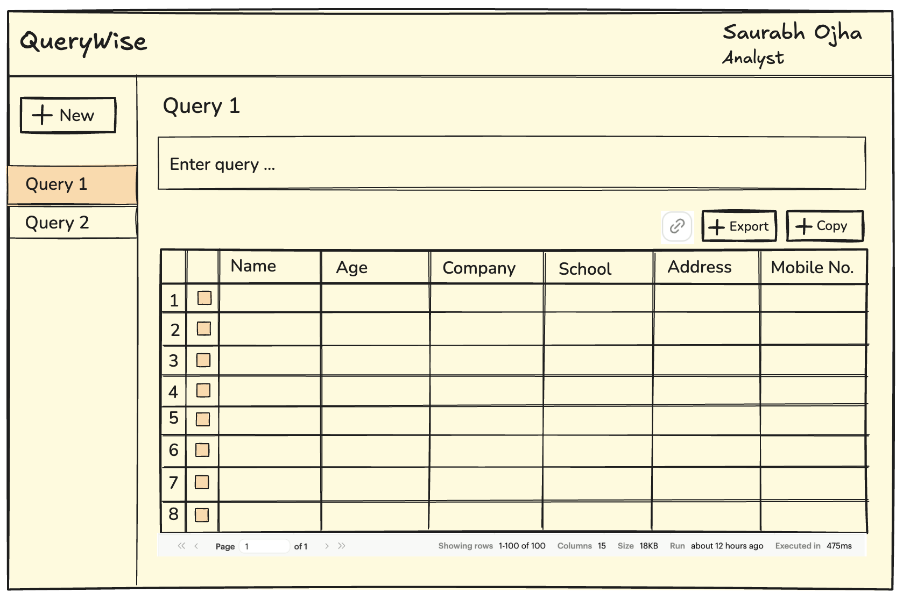
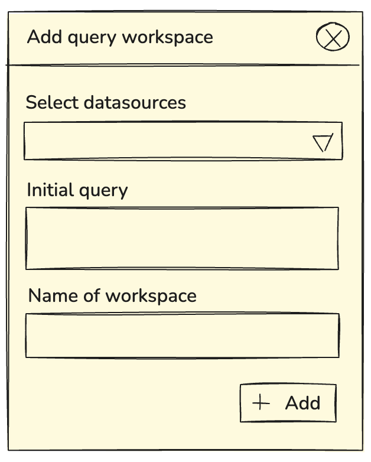

# SQL Wise Query Visualizer

A simple application to run queries on selected data sources. Results of the query on the datasource is displayed to the user.
The user will be able to run operations on data like exporting selection, pagination, sharing links

## Frameworks and Libraries

- React with TypeScript
- Vite for bootstrapping and HMR
- ShadCN UI components
- ShadCN Table with Tanstack react-table
- Lucide react for icons
- useReducer for data management
- React router of single page routing
- PapaParse for converting csv data to JSON and vice-versa
- localStorage for persistence

## Tools Used

- Midnight Bloom theme from https://tweakcn.com/editor/theme
- App logo generated using Claude AI
- Cursor for AI enabled editing

## Data Sources

- CSV files located at https://github.com/graphql-compose/graphql-compose-examples/tree/master/examples/northwind/data/csv

Uses Vite with HMR and some ESLint rules.

## Requirements

### Must Have

1. User should be able to add, view, edit, save their SQL queries.
2. User should be able to view the results of the queries in a friendly format.
3. User should be able to export the query results.
4. User should be able to copy to clipboard the query results.
5. User should be able to add new query workspace by choosing the initial datasource and optionally adding a query workspace name.
6. User should be able to edit the query workspace name.
7. User should be able to share the query they write with colleagues.
8. User should be able to use and load the application easily. As data can be huge, performance is important - needs pagination to speedup render perf.
9. User should be able to access their queries and workspaces easily.
10. User should be able to toggle between light and dark modes.

### Good to have

1. Sorting and filtering data - we will assume majority of user have a basic grasp on SQL which provides powerful sorting and filtering constructs. So visual sort/filter is of slightly lesser importance.

2. User should be able to view all available datasources in their workspace.

### Out of scope

1. login and authentication system

### Rough mocks




## Architecture

- There is only **one** component - the **frontend**.
- Server side code is abstracted and mocked using JSON/CSV files located in `public/mocks/`
- Centralized Redux-like datastore using `useContext`, `useReducer` and Providers.
- React router to expose two routes dashboard (`/` or `query`) and
  query workspace (`/query/:queryId`)
- ShadCN atomic components (`components/ui` and `components/composite`) serve as the ui library. These are composed to build complex rich components eg: Sidebar, DataGrid.
- `QueryView` page uses react hook for handling business logic (`hooks/use-query-results`)
- layout is organised into `pages` and `sections` see **Folder Structure**

### Folder structure

- **src/main.tsx** - loads react, contains react router config, store provider, theme provider and root toaster.

- **src/pages** - contains

  - main page of app (queryView)
  - initial landing page (initialView)

- **src/sections** - contains smaller fragments of the layout like sidebar, resultsGrid, header, modal dialog form, custom inputs, custom editable heading, column configs for the data table.

- **src/lib** - parsing utils and file download utils

- **src/store** - contains the providers and data store

- **src/api** - simple promisified functions. Use fetch API to load and parse CSVs and JSON in the public/mocks folder

- **src/components/ui** - all ShadCN library components are located here

- **src/components/composite** -

  - Data table composed from header, rows and pagination.
  - Data handling is done using tanstack table.
  - **Export to file** and **Copy to clipboard** are core functionality, so they are added as part of the composite component.

- **public/mocks** - contains data files for tables and initial application data

### Data Model and Flow

- QueryProvider exports two contexts which exposes store and dispatch:
  - `QueriesContext` (the store)
  - `QueriesDispatchContext`(the dispatch function)
- QueryProvider initializes the query store by reading the `public/mocks/queries.json` file.
- Query Store is an normalized store object - `queryId` is the key and value is of `Query` type.
- Each query entry models a named workspace and its data.
- Each query has a `datasource` field - corresponds to the CSV file.
- Each query is a workspace link in the sidebar - link redirects to unique workspaces.
- Each query workspace has functionality to edit query name/ value and delete query.
- Each workspace, the `query.dataSource` is used to find the corresponding CSV file to load - serving as the result for the query.
- `QueryStore` has a reducer which exposes Create, Update, Load initial state and Delete actions.

```
type QueryStore = Record<string, Query>;

type Query = {
  name: string;
  value: string;
  dataSource: string;
  createdAt: string;
  updatedAt: string;
};

store = {
    queryId1: Query1,
    queryId2: Query2,
    ...
}
```

#### Routes

- Dashboard route is `/`
- Query workspace route is `/query/:queryId`

### Interfaces

- `src/api/api.ts` - has two promisified functions for loading initial store data (`queries`) and DB (`.csv`).
  - `getEntities` load the static file for DB tables using `fetch` API. Converts CSV to JSON and returns as a `promise`.
  - `getQueries` - loads `queries.json` and returns a `promise`.

### Optimizations

- Paginated grid for network optimization
- Vendor chunk is separated and preloaded out for network optimization
- React Memo for name, input and grid components for reducing renders.
- useCallback hooks for preventing child re-renders on parent renders.
- debounce on auto-updating query value input to prevent excessive API calls.

### Decision logs

#### Codebase - Typescript or not

- Typescript makes the application future proof in terms of scaling by catching errors in complex scenarios.

#### UX - Pagination vs Infinite scroll

- [Norman Nielsen: When to use and when to avoid infinite scroll](https://www.nngroup.com/articles/infinite-scrolling-tips/)

- [Smashing Magazine better infinite scroll](https://www.smashingmagazine.com/2022/03/designing-better-infinite-scroll/)

#### UX - Modal vs sidebar (new query)

- [Modal UX design best practices](https://blog.logrocket.com/ux-design/modal-ux-design-patterns-examples-best-practices/)

- [Norman Nielsen - modals vs non-modals](https://www.nngroup.com/articles/modal-nonmodal-dialog/)

- [When to use a modal and when to redirect page](https://uxplanet.org/modal-vs-page-a-decision-making-framework-34453e911129)

#### UX - Horizontal tab view for query workspace vs left side vertical links

- [Norman Nielsen - When to use left side vertical navigation](https://www.nngroup.com/articles/vertical-nav/)

- [Medium ](https://medium.com/swlh/top-navigation-vs-side-navigation-for-your-interface-3c1f176bc6ae)

#### Library: Parse CSV to JSON by hand vs Papaparse

- Time constraint and handling complex scenarios

#### Library: ShadCN

- prebuilt defaults and easier customization and composition
- components in code - can edit library code easily
- simple tree-shaking and library size optimizations
- good support for tailwind CSS
- great documentation

#### Library: Tanstack table

- Good interface providing heavy lifting out of the box
- Good documentation and code examples
- Flexible and provides ability to compose customized components
- Lightweight and written in react first manner

#### Code: Redux toolkit vs useReducer with useContext and useProvider

- Simpler data management scenarios
- No slices of data
- Time constraint
